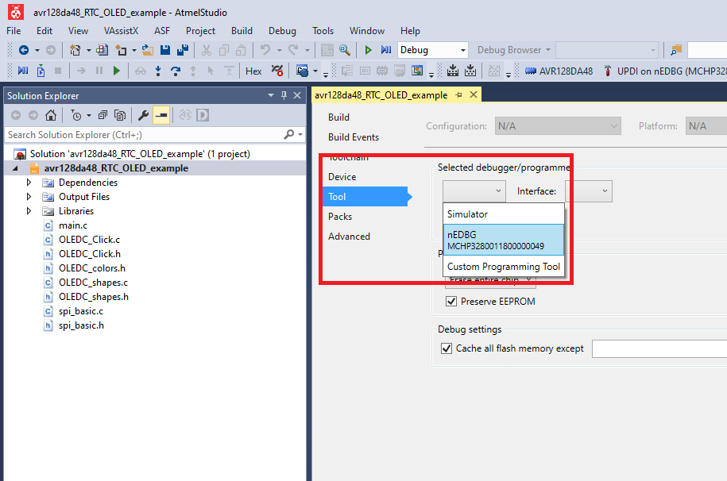

# AVR128DA48 RTC with OLED Click Code Example

This repository provides an Atmel Studio solution with a bare metal code example for an RTC implementation.
This example implements a desktop clock built using the AVR-DA's RTC and an OLED Click.
The clock can be set to the correct time through the use of the on-board user button connected to PC7 (on-board SW0).
Long pressing (at least 1 second) SW0 will switch between seconds, minutes and hours to be changed and short pressing SW0 will increase the value of the selected time unit.

## Related Documentation
More details and code examples on the AVR128DA48 can be found at the following links:
- [AVR128DA48 Product Page](https://www.microchip.com/wwwproducts/en/AVR128DA28)
- [AVR128DA48 Code Examples on GitHub](https://github.com/microchip-pic-avr-examples?q=avr128da48)
- [AVR128DA48 Project Examples in START](https://start.atmel.com/#examples/AVR128DA48CuriosityNano)

## Software Used
- Atmel Studio 7.0.2397 or newer [(microchip.com/mplab/avr-support/atmel-studio-7)](https://www.microchip.com/mplab/avr-support/atmel-studio-7)
- AVR-Dx 1.0.18 or newer Device Pack

## Hardware Used
- AVR128DA48 Curiosity Nano [(DM164151)](https://www.microchip.com/Developmenttools/ProductDetails/DM164151)
- Curiosity Nano Base for Click boards™ [(AC164162)](https://www.microchip.com/Developmenttools/ProductDetails/AC164162)
- OLED Click board™ [(MIKROE-1585)](https://www.mikroe.com/oled-c-click)

## Setup
The AVR128DA48 Curiosity Nano Development Board is used as test platform
 

The following configurations must be made for this project:

RTC:
  - RTC Clock
  - Input clock 32 kHz / 32
  - Overflow interrupt enabled
  - Period 0x3c4

TCB0:
  - Input clock main clock (16MHz) / 2 (from prescaler)
  - Period: 0x1d4c
  - Overflow interrupt enabled

SPI0:
  - SPI Master Polled mode
  - Input clock main clock (16MHz) / 4 (prescaler)
  - MISO - PA5
  - MOSI - PA4
  - SCK - PA6

OLEDC_Click:
  - SPI Master
  - CS pin - PA7
  - DC pin-  PD0
  - EN pin - PD6
  - RST pin - PD7
  - RW pin - PD3

CPUINT:
  - Global interrupts enabled

|Pin            | Configuration                              |
| :-----------: | :----------------------------------------: |
|PA4 (MOSI)     | Digital Output                             |
|PA5 (MISO)     | Digital Input (internal pull-up disabled)  |
|PA6 (SCK)      | Digital Output                             |
|PA7 (OLED CS)  | Digital Output                             |
|PC7 (SW0)      | Digital Input (internal pull-up enabled)   |
|PD0 (OLED DC)  | Digital Output                             |
|PD3 (OLED RW)  | Digital Output                             |
|PD6 (OLED EN)  | Digital Output                             |
|PD7 (OLED RST) | Digital Output                             |

## Operation

1. Open the *avr128da48_RTC_OLED_example.atsln* solution in Atmel Studio

2. Build the solution: right click on *avr128da48_RTC_OLED_example* solution and select Build
 

3. Select the AVR128DA48 Curiosity Nano on-board debugger in the *Tool* section of the project settings:
- Right click on the project and click *Properties*;
- Click *Tool* tab on the left panel, select the corresponding debugger and save the configuration (Ctrl + S)
 

4. Program the project to the board: select *avr128da48_RTC_OLED_example* project and click *Start Without Debugging*:
 

Demo:
 

## Summary

This example represents a implementation of a desktop clock built using the AVR-DA's RTC and an OLED Click. The clock can be set to the correct time through the use of the on-board user button connected to PC7 (on-board SW0).
